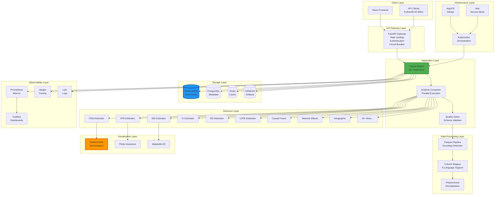
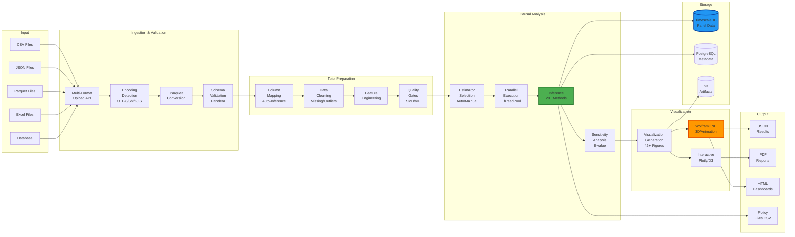
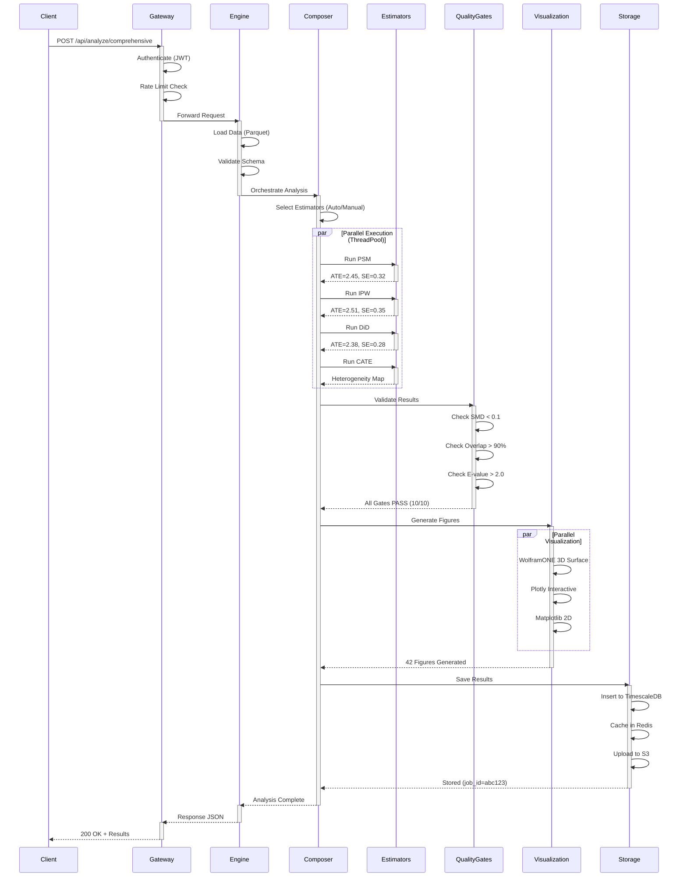
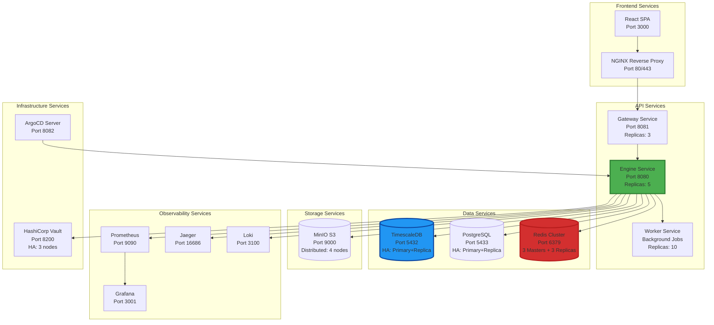
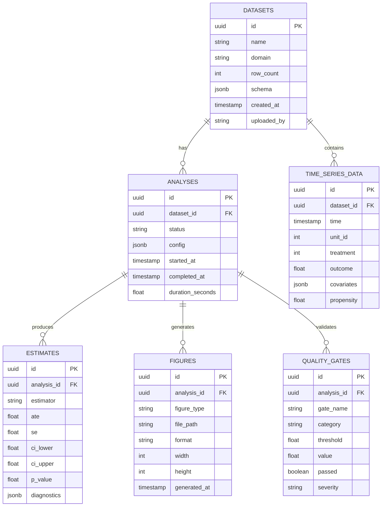
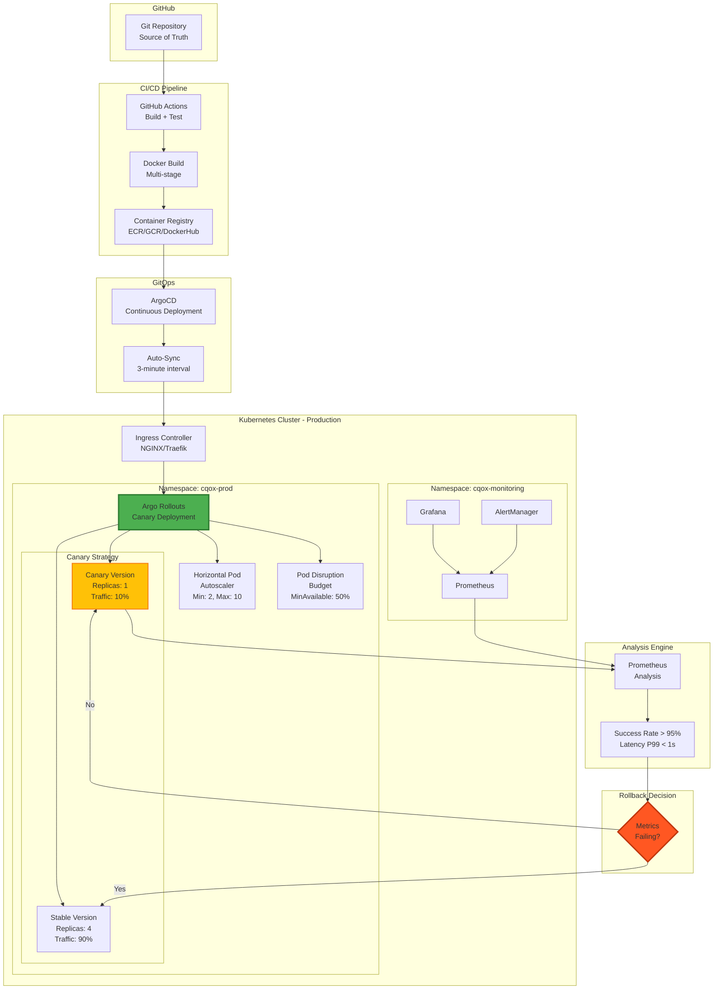
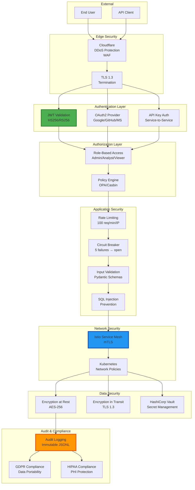
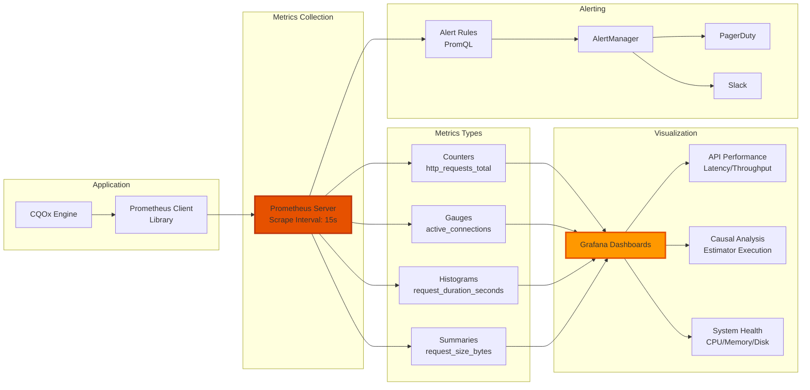

# CQOx System Architecture Diagrams

This document contains comprehensive system architecture diagrams for the CQOx platform.

## Table of Contents
1. [High-Level System Architecture](#high-level-system-architecture)
2. [Data Flow Architecture](#data-flow-architecture)
3. [Causal Inference Pipeline](#causal-inference-pipeline)
4. [Microservices Architecture](#microservices-architecture)
5. [Database Schema](#database-schema)
6. [Deployment Architecture](#deployment-architecture)
7. [Security Architecture](#security-architecture)

---

## High-Level System Architecture

---

## Data Flow Architecture

---

## Causal Inference Pipeline

---

## Microservices Architecture

---

## Database Schema

---

## Deployment Architecture

---

## Security Architecture

---

## Performance Metrics Flow

---

## Notes

- All diagrams are rendered using Mermaid.js
- Diagrams are versioned with the codebase
- Update diagrams when architecture changes
- Export PNG versions for presentations: `mmdc -i diagram.mmd -o diagram.png`
